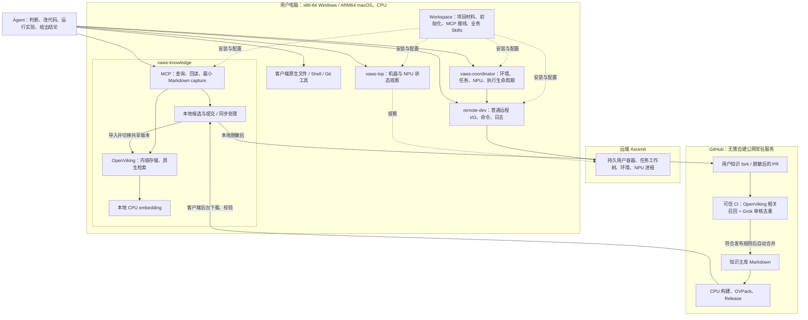
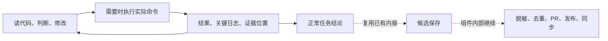

# VAWS 开发效率与 OpenViking 接入 Spec

Status: current

日期：2026-09-11。本文是下一阶段的实施方向与目标行为，**不表示这些能力已经实现**。用户已确定“宽松、先信任、不增加 Agent 负担”的原则，并认可精简现有流程。当前安装版本仍由 `pyproject.toml` 和 `uv.lock` 描述；实现进度见本文末尾的工作批次。

客户端平台范围：**ARM64 macOS（Apple Silicon）与 x86-64 Windows，CPU-only**。当前批次以 macOS 主链路为提交基线；Windows 环境由用户后续准备，再用原生 PowerShell 5.1/7 验证，不阻塞本批 PR。Intel Mac 不在本阶段范围。

发布策略：先快速具备当前能力，允许破坏性接口和格式变更，不为旧版本添加兼容层。正式发布阶段再确定兼容性承诺和 Windows 验证要求。

本文细化 [target-state.md](target-state.md) 中的目标架构。开发体验、知识格式和后续实施范围以这两份文档为准；现有脚本中的旧限制是待改造项，不是新设计需要保留的条件。修改每条实现路径时，同步更新对应 skill、脚本、参考文档和受影响检查。

## 1. 目标与默认原则

VAWS 要减少 vllm-ascend 开发中的环境准备、重复排查和证据整理成本。Agent 保留技术判断、命令选择、实验顺序和验证范围的决定权。

- 普通本地阅读、编辑和 Git 操作直接使用客户端原生工具。
- Skill 提供便捷入口和领域方法；计划、报告和固定实验流程按任务需要使用。
- 工具能够取得的身份、版本、路径和运行结果由工具记录，不让 Agent 重复填写。
- 配置、来源或知识缺失时如实标记未知，继续不依赖这些信息的工作。
- 已有授权和配置持续生效；只为真正缺失且影响结果的信息发问。
- 共享资源归属、公开前脱敏和实际执行结果由实现负责检查。
- 测试范围由具体改动决定；不因使用 VAWS 自动扩大验证矩阵。

一个新增机制只有在减少重复操作、等待或诊断成本时，才适合进入默认开发路径。

## 2. 整体架构



业务 Skills 调用现有组件；图中的方框不是要求 Agent 逐个调用的步骤。知识发布不占用开发任务的等待路径。普通远程 I/O 不要求先创建托管执行；托管 NPU 运行仍由 coordinator 管理。

保留四个 runtime owner。OpenViking 和 embedding 是 vaws-knowledge 的内部依赖，独立知识内容仓库是数据仓库，不新增第五个调度器、总控 Agent 或工作流引擎。

## 3. 代码和数据归属

| Owner | 承担的工作 | Agent 需要提供 |
|---|---|---|
| workspace | 项目材料、依赖安装、两个 fork 初始化、客户端接线、简短业务技能入口 | 用户目标和实质配置选择 |
| remote-dev | 普通远程文件/命令操作、连接、传输、后台进程、输出回读 | 普通 endpoint 与操作参数 |
| vaws-coordinator | 原生 task 关联、实际工作树、环境准备、资源分配、执行和恢复、运行事实记录 | 命令及必要环境、资源、拓扑需求 |
| vaws-top | 缓存与实时的机器、NPU、挂载观察 | 需要查看的目标；不承担设备分配 |
| vaws-knowledge | OpenViking 接入、Markdown 捕获、脱敏、候选提交、审核工具、版本分发与本地同步 | 自然语言查询，或标题和正文 |
| 知识内容仓库 | Markdown、PR、发布策略、调用知识包命令的 CI、Release | 无日常手工操作要求 |

知识内容仓库暂名 `vaws-knowledge-corpus`；创建和最终命名在对应实施批次完成。运行时代码不再以携带整份语料的 wheel 作为主要知识更新渠道。

实现留在已有 owner 中。workspace 可以转换业务结果和提供薄 CLI，但不复制 OpenViking、知识审核或 coordinator 的实现。

## 4. Agent 的日常路径



**初始化。** 用户授权初始化后，复用现有配置，缺失时采用明确的默认值，完成 workspace fork、知识 fork、依赖、MCP 和适用客户端的 hook 接线。首次无法推导的实际配置再集中询问。保留其他 remotes 和客户端配置；不因初始化强行丢弃已有代码或改动。

**执行。** `vaws_run` 保留通用命令能力；服务、benchmark、profiling 等 skill 是更方便的业务入口。模型新参数和临时诊断命令不应要求先修改框架。已有业务参数和资源需求可以覆盖默认值，实际执行的配置自动记录。

**身份。** 原生 attachment 提供任务 context，客户端/包负责传递。明确绑定的工作树可以复用；任务身份不从 cwd、最近聊天或另一任务猜测。普通知识捕获缺少来源 context 时，可以保存为来源未知的候选；这不赋予任何远端资源访问权。

**反馈。** 默认先返回结果、关键输出、实际目标和证据位置。完整机器记录由工具保存，可按需展开。失败应保留原始输出和部分结果；确定不了原因就显示未知，不为了补分类而重跑实验。

**收尾。** 复用 Agent 的正常总结和已经存在的证据。有可用 hook 的客户端自动提交已有摘要；缺少适配时，最多一次 `capture`，不要求第二份总结或表单。没有新增知识时允许空操作，开发任务不等待知识 PR 合并。

## 5. 知识的最小契约

### 5.1 Markdown 与公开边界

作者只需要标题和非空正文。下面这样的文档即可保存为候选：

```markdown
# 一次图模式启动失败的排查经验

当时遇到了……，检查后发现……，采用……后启动成功。
只在当时环境验证过，其他版本尚未确认。
```

不要求 frontmatter、UUID、固定章节、类型枚举、标签、来源字段、证据字段或 12 个运行坐标。可选信息可以直接放进正文；工具保留已知版本、错误文本、来源和证据，不自动泛化或编造未知值。

本地私有候选可以保留排障所需的原始信息。提交公共 fork、PR 或云端审核前，由本地生成脱敏副本；脱敏未通过只阻止该内容外发，不阻止本地保存、查询或继续开发。公开内容的硬格式要求是标题、非空正文、脱敏通过。

格式合格表示可进入候选和 PR。发布审核通过表示适合作为相应内容发布，不代表 Grok 复现过硬件结果。普通经验不因缺少结构字段被拒绝；精确指标或普遍性结论必须与已有证据相称。

### 5.2 三个逻辑层

| 层 | 权威内容 | 更新方式 |
|---|---|---|
| shared | 公共知识主库的固定 Git 版本 | 只读导入已发布版本 |
| project | 当前项目维护的 Markdown | 项目 Git/本地文件更新后同步索引 |
| candidate | 本地会话经验与待提交草稿 | 本地捕获；外发另行脱敏 |

Markdown/Git 是内容权威，OpenViking 索引可以重建。使用原生 URI/目录区分三层；共享更新不能覆盖 project/candidate。路径和 Git 版本足以定位公共文档，作者不维护另一套 ID。

第一版按配置的 workspace 共享一个本地知识实例，各原生客户端连接复用。状态位于 `.vaws-local/knowledge/`，服务仅监听回环地址，生命周期和自有进程由知识包处理。

### 5.3 面向 Agent 的接口目标

以下是拟议的新包接口，不是当前已发布 API 的调用示例。实现尽量沿用已有三个 MCP 工具名。

| 操作 | 必需输入 | 默认结果 |
|---|---|---|
| `knowledge_query` | `text` | 少量相关摘要、内容引用、已有来源/审核状态；不可用时明确标记 |
| `knowledge_explain` | 已返回的内容引用 | 正文、已有适用条件、来源及实际审核信息 |
| `knowledge_capture` | `title`、`content` | 本地保存结果与引用；后续提交异步处理 |

上下文、版本、证据引用可由工具附带，不成为必填项。提交、同步、索引维护由包处理，管理入口按需提供，不要求 Agent 每次 capture 后再逐个调用。

查询可以按已知条件排除明确不适用的条目；条件未知的相关经验仍可返回。先过滤再计算最终条数，不能先截很少的结果再把未知项筛光。索引不完整或不可用时标明状态，不能把无命中解释成“不存在”。

本地经验与公共知识一起参与检索，按问题相关性和已知适用条件排序，不因未经过公共审核而排除或降权。本地内容也是可信的参考来源；审核体现对公共发布内容负责，不建立跨层信任等级。来源和审核过程用于追溯，所有知识均是参考而非公理，Agent 仍结合当前代码、环境和运行结果判断。

### 5.4 OpenViking 使用范围

首版固定 OpenViking 0.4.19 作为起点，沿用本轮实测的 FastEmbed/ONNX Runtime CPU embedding 配置。实际模型、tokenizer、维度和参数由包版本/发布产物固定；平台依赖在目标平台验证后确定。

直接使用原生内容写入、检索、更新、删除和 OVPack。候选首先保存为 Markdown，并通过原生能力索引；首版直接复用 Agent 已经整理的摘要，**默认不再调用一个生成模型做第二次提炼**。

后续确实需要 Session/Memory 自动整理时，使用原生模板扩展，保留具体技术条件；原生经验替换仅作用于本地候选，公共内容修改仍通过 Git diff。不要为接入而默认启用所有原生功能。

原生检索承担相似项召回。辅助标签、已知条件或路径映射优先用原生字段；仅为实际需要生成小型 sidecar，不建设另一套索引或复杂知识 schema。

## 6. PR 审核与知识分发

### 6.1 候选到主库

1. 本地保存已有总结，脱敏生成公开 Markdown。
2. 知识包写入用户知识 fork 并创建 PR；同一候选重复提交复用原记录，离线/鉴权失败保留待提交状态。
3. 可信 CI 使用 OpenViking 召回相关已审核条目，Grok 判断新增、重复、补充、条件差异与冲突。
4. 新内容满足发布策略即自动合并；重复内容不重复入库；需要归并时先生成可审阅 diff，再检查新 head。
5. 普通经验可以带范围未知/报告者观察的表述发布。真正需要取舍的冲突由 Grok 说明分歧、依据和建议，交由人决定方向；Grok 随后按决定修改候选及相关公共原文，重新检查并完成合并。证据不足时可以决定补充证据或保留不同观察，不阻塞原开发任务。

审核规则按内容适用，不要求作者预选类型。已有 Grok advisory 实现需要升级为真正的发布判定与自动合并流程。

**人工决策与自动解冲突。** 允许 Grok 改写公共知识。首版直接使用知识 PR 的评论/审核回复承载人工决定，不另建决策后台，也不要求人填写 JSON、类型或运行坐标。Grok 给出简短的冲突摘要、相关内容和建议选项；有相应仓库权限的人决定取舍，Grok 负责生成修改、运行检查并继续合并。正常去重、补充和已明确的条件差异自动处理，人工介入聚焦真正需要判断的分歧。

人工决定记录实际回复者、回复引用和所针对的冲突内容及代码版本，不能把 PR 正文中的自称批准当作授权。Grok 按既定决定生成新 head 后重新审核技术结果，不因这次预期修改本身重复询问。后续内容、证据或主库变化若实质改变原先的取舍，再请求新的决定；无关版本推进只重新检查。等待决定只影响该条公共贡献，本地知识和开发流程照常可用。

CI 运行可信包代码，把 PR 文本当作数据。审核结果绑定候选 head 与所依据的主库版本；head 改动后重新审核，主库推进时重新核对相关重复/冲突，避免两个并发 PR 分别通过后重复入库。不要执行 fork 提供的脚本来使用审核凭证。所有这些检查在包/CI 内完成。

### 6.2 主库到客户端

审核后的固定 Git SHA → CPU 构建 → OVPack 与必要版本信息 → GitHub Release → 客户端后台下载/校验 → 导入新共享版本 → 切换当前版本。

- 首版使用完整 dense 向量包，导入采用 `vector-mode=require`。客户端仍建立本地索引并计算查询向量，不静默回退整库文档重嵌入。
- 发布信息记录内容 Git 版本、构建包/OpenViking 版本、模型与 tokenizer 标识和校验值、维度/参数及产物完整性信息。校验值不替代 Git 代码身份，也不形成 workspace 握手协议。
- 新版本独立导入，内容与索引校验完成再切换；失败继续使用旧版本。Windows 不覆盖仍被打开的数据库文件。
- 同步在知识组件启动时及存活期间周期检查；停止期间下次启动补齐。没有变化时安静处理。
- 旧版本缓存的清理与知识内容老化分开。首版不实现向量差分协议、知识自动过期策略或新增 OS 定时任务。

GitHub Actions 是临时构建/审核环境，Release 是分发入口；无需自行运维公网服务。Grok 的调用发生在脱敏后的审核路径，日常本地查询不依赖云端模型。

## 7. 精简现有流程的实施要求

| 改造项 | 目标行为 | 主要位置 |
|---|---|---|
| 初始化确认 | 已有授权内一次执行默认流程；复用配置，真正缺项才问 | workspace 的 repo-init 与客户端安装 |
| 必填计划与记录 | 允许先实验后汇总；普通笔记和实际输出可以直接使用 | 调试、Triton、change-validation 等业务 Skills |
| 证据引用 | 已有实验不因缺少 `parent_run_id` 或不同记账标签而拒绝；核对结论所需的实际代码、环境、输入、测量口径和证据 | change-validation、comparability 与结果适配 |
| 自定义实验 | 默认提供脚本/preset，也允许通过正常托管执行使用自定义命令；无法解析的结果保留原文和未知状态 | benchmark、serving、调试入口 |
| 重复信息 | 身份、工作树、运行配置、版本、日志自动携带 | coordinator、客户端、业务结果包装 |
| 成功输出 | 默认紧凑视图，完整记录可回读；不新增执行状态或另一套事实来源 | 各工具结果呈现、Result Envelope 适配 |
| 知识 schema | 标题、正文、公开脱敏；来源和适用条件有则保留 | vaws-knowledge、知识薄 CLI、capture hook |
| 文档负担 | AGENTS 留常用入口；skill 首屏给典型调用和关键判断，详细材料按需读 | workspace 文档与 Skills |
| 组件故障传播 | 知识/观察不可用不阻止无依赖的开发与执行；依赖偏离 pin 提示，不因漂移本身阻断 | 客户端与各 owner |

证据重用不改写原始运行记录，也不创建或推断资源访问权。缺失的关键实验事实影响该结论是否成立，但不强迫重跑与问题无关的测试。完整 Run Manifest/Result Envelope 由实现自动生成；不要求 Agent 手工编辑。

本地纯 Python workspace 检查可以本地运行，NPU 相关 torch_npu/vLLM 执行去远端。失败先读已有输出，不能把自动重跑作为补齐记录的手段。

## 8. 实施批次与验收

2026-09-11 提交状态：A 与 B 的当前本地能力已实现；D/E 的贡献审核、构建与本地版本切换模块已实现，公共网络与自动生命周期仍待接线。ARM64 macOS 当前链路已验证；Windows、五客户端真实远端与 NPU 业务验收后续完成。以下表格保留各批次的完整目标，不将模块测试等同于整套公共发布闭环完成。

| 批次 | 交付物 | 完成依据 |
|---|---|---|
| A：精简开发入口 | 授权/默认值、可选计划与记录、事后证据引用、紧凑输出、自定义实验入口 | 选定普通开发路径不新增手填管理文件；已有实验可以事后汇总；受影响测试通过 |
| B：本地知识最小链路 | OpenViking 封装、最小 Markdown、三层索引、query/explain/capture、CPU embedding、实例复用 | 仅标题+正文可保存查询；已有具体条件保留；修改/删除/重启有效；知识不可用时开发继续 |
| C：早期平台验证 | 可安装的客户端与原生 OVPack 导入 | x86-64 Windows 原生 PowerShell 5.1/7、ARM64 macOS 分别验证；覆盖中文/空格路径、锁、重复启动、重启和自有进程退出 |
| D：自动知识贡献 | 两个 fork 初始化、已有摘要捕获、脱敏、自动 PR、Grok 去重与合并 | 新增/重复/补充/条件差异/冲突以及 head、主库推进处理正确；离线保留草稿；普通开发不等待审核 |
| E：预建分发 | 主库构建、Release、后台同步与完整版本切换 | 文档向量不重算；修改与删除随版本生效；导入失败仍可查旧版；共享更新不覆盖本地知识 |
| F：真实开发验收 | 一次小修复、一次服务/benchmark、一次 graph 或分布式排障 | 对比已有工具记录：额外调用/说明阅读减少，首个有效 NPU 结果与收尾不因框架变慢，知识能避免重复排查 |

C 在 B 的最小链路完成后立即进行，早于大规模接入和跨客户端铺开。D、E 的包/CI 工作可以沿清晰边界推进；这里不要求新增调度系统或启动并行 Agent。

每批跑受影响的最小检查，最终做一次整体业务闭环。ARM64 macOS 已测结果不能替代 x86-64 Windows 运行验收。使用现有日志和结果记录评估开发成本，不另建指标平台。

## 9. 当前证据与迁移边界

截至本轮研究，OpenViking 0.4.19 已完成本地 CPU 的小规模与约 5 万条短知识检索/增量实验；1 千条 dense OVPack 在本机隔离实例间通过导入、正文一致、检索一致与重启检查，导入阶段未重算文档 embedding。

尚未完成 x86-64 Windows 的完整业务验收、跨平台 OVPack 接收、5 万条包的发布/导入测量，以及 Grok 自动合并与各客户端收尾的端到端验证。ARM64 macOS 也仍需接入后真实业务验收。上述能力属于本 spec 的实施验收，不是现有支持声明。

原生能力依据：[Memory API](https://github.com/volcengine/OpenViking/blob/v0.4.19/docs/en/api/16-memory.md)、[检索 API](https://github.com/volcengine/OpenViking/blob/v0.4.19/docs/en/api/06-retrieval.md)、[OVPack](https://github.com/volcengine/OpenViking/blob/v0.4.19/docs/en/guides/09-ovpack.md)。OVPack 的预计算向量快照目前限定 dense；原生 local embedding provider 与本轮 FastEmbed 配置不同，替换模型/运行时需要重新核对质量与平台支持。

本批 workspace 固定引用新的 0.3.0 知识提交，替换 YAML 查询/捕获入口并放宽计划关联；不维护长期 YAML 兼容引擎。旧知识没有强制迁移要求，需要保留的有用条目可一次性转换。发布、依赖更新和客户端切换要同步体现真实进度。

本阶段不扩展到 PDF/OCR、完整聊天自动上传、GPU 客户端、知识评分后台、自动老化、多后端动态选择或自行托管的公网服务。
