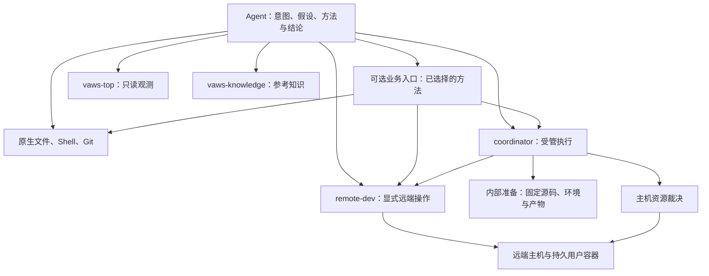

# VAWS 核心与 coordinator 重设计

Status: proposed target design, 2026-09-12. Execution inputs and scoped reuse are implemented in coordinator 0.4; remaining proposals are not the current API.

本方案以 [九条设计原则](design-principles.md) 为依据，重新审视此前的 Core 草案与已完成实验。本文取代旧草案中的强 session、统一研发 Core 和通用业务程序引擎等预设。允许破坏性替换，不保留过时接口和兼容适配器。coordinator 0.4 已实现固定执行输入、独立源码目录、按变化复用环境与原生产物，以及无需项目源码的普通命令；其余提案不代表现有能力。当前可调用能力见 [现有运行合同](target-state.md) 和 [调用合同](coordinator-consumption.md)。

## 1. 结论与对旧草案的修正

**VAWS 提供可按需组合的研发能力。核心的中心对象是一次明确的受管执行；coordinator 对它从准备到收尾负责。Agent 负责研究问题、实验选择和结果判断。**

保留 coordinator 这个 owner，以“受管执行”为职责边界。源码准备和环境复用是兑现执行的内部能力，任务上下文是方便调用的辅助信息。没有证据表明改包名为 `vaws-core` 能降低任务成本，本方案不做这一改名，也不新增一个覆盖所有能力的 Core 服务。“核心”在本文中指这些合同及其协作。

| 旧草案的预设 | 本次决定 | 对任务成本的影响 |
|---|---|---|
| 将完整任务与命名版本管理作为强 session 建设 | 身份与默认值轻量持久化；执行独立固定输入 | 保留上下文复用，解除任务、远端目录与环境的绑定 |
| 预先确定六领域、统一 authority 的完整 Core 架构 | coordinator 只对明确的受管执行负责；辅助模块留在内部 | 围绕执行消除重复成本，不先建设一整套研发核心 |
| Session、Run、Execution、Service 四类入口作为固定目标 | 常用受管语义是提交与操作执行引用；上下文设置及命名服务按需出现 | 不把工具数量或一组名词当作设计目标 |
| Core 新增持久本地业务控制 execution 与检查点合同 | 普通脚本与已有进程能力承载选定的机械程序；不建设通用工作流引擎 | 避免为开放探索引入计划、检查点协议和自动重放 |
| 一个完整恢复矩阵是新核心的前提 | 优先处理已有证据的常见故障；不确定副作用保留事实后交还 Agent | 允许在明确边界结束自动化，减少低收益复杂度 |
| 已允许轻量任务绕过 Core，后端独立可用条件未展开 | 明确仅受管执行依赖 coordinator；本地工具和显式远端 I/O 独立可用 | review、读目录、查已有日志不承担管理流程 |
| 缓存检查的成本和失效范围定义不足 | 工具按实际变化和已知兼容合同检查；已有结果可复用 | 保留正确性要求，消除无关安装、编译和全量重测 |

保留已有的真实身份、Git 内容捕获、构建指纹、持久容器、远端进程监督、资源裁决和原始证据。破坏性改接口不意味着重写这些有效实现，更不意味着删除业务数据或正在使用的容器。

## 2. 实验与调试证据支持什么

下表区分已观察现象、设计推论和证据边界。它不是重新运行全部实验的要求。

| 证据 | 对设计的直接影响 | 不能据此声称 |
|---|---|---|
| 20 个 Skill 的人工语义审查发现描述边界重叠；收窄了 5 个描述 | 入口只提供适用信息，轻量任务能直接使用原生工具 | 已测出模型误触发率或需要新增强制路由器 |
| Windows 普通远端四机共 120 次文件、命令和交互操作通过；最初两次超时的根因未确定 | 显式远端 I/O 继续由 remote-dev 独立完成；超时保留阶段证据 | 所有远端操作都需要受管环境，或超时必然来自某个网络环节 |
| CLI 成对实验中 session help 中位数从 424 ms 降至 234 ms；help 无需启动后端 | 按需导入和惰性发现值得保留；普通调用不全量 doctor | 已经较快的每个入口都值得重构 |
| 176 包的本地缓存安装，copy 为 25.56–26.11 s，hardlink 为 8.20–8.92 s | 优先复用包缓存和兼容环境，避免每次任务重建 | 这是跨盘实测、远端环境耗时，或硬链接适用于任意可变环境 |
| 三次独立 SSH 查询合为一次，中位数由 13.768 s 降至 4.601 s | 合并已选定的相关机械查询；使用现有持久连接 | 可以为节省调用而合并尚需中途判断的实验 |
| 后续热连接短命令约 1.54/1.59 s；隔离 shell 原型约 0.49/0.57 s，但丢失函数并改变 PATH 顺序 | remote-dev 优先优化有明确初始化合同的环境 | 直接跳过 shell 初始化就语义等价，或该原型已交付 |
| eager/TP=2 graph 服务通过探测；重连复用同一执行；13 次诊断与验证执行均终态且释放 | 保留一次启动跟随准备/就绪、已有服务引用和自动清理 | 13 次全部成功、四机联合推理通过，或已有性能/精度结论 |
| 已验证 vLLM 源码与快照 SCM 版本不一致，触发插件错误导入分支 | 源码内容、真实版本来源、安装元数据必须同时保留 | 可通用地硬编码某个版本变量 |
| native 安装成功，但 profile 缺 SoC；从完成的构建证据恢复后可继续 | 产物与证明材料分别保存；缺元数据先核对已有产物与可靠日志 | 缺记录就应全量重编译；也不能仅凭安装退出码判兼容 |
| 已实现 exact clean-source 快捷路径，实际命中后未传输；WSL 大工作树反复快照曾超时 | 扩展已有内容复用，减少重复扫描及按角色重复捕获 | 每次全目录重校验是复用必需成本 |
| 当前代码仍用活动执行阻止换工作树，按 session/host/role 生成目录，并在推进时读取 session 路径；服务比较未包含源码快照 | 拆开可变默认值、固定执行输入、可复用准备成果 | 仅优化日志或将旧步骤包成一次调用就解决了对象耦合 |

这些跨平台修复还证明：UTF-8、POSIX 远端路径、进程树归属、退出码和原始日志是边界明确且高价值的工具保证，应保留相应测试。它们不该变成每次任务的 Skill 操作步骤。

## 3. 组件关系



箭头表示依赖和调用关系。准备与主机裁决属于 coordinator 的实现，不新增两个产品或要求 Agent 分别操作。

| 所有者 | 核心职责 | 边界 |
|---|---|---|
| remote-dev | 对明确 endpoint 执行文件、命令和作业操作，监督远端进程，复用连接 | 不识别 VAWS 任务，不分配 NPU，不选择业务环境 |
| coordinator | 在明确输入、环境及资源约束内准备、启动、观察与结束受管执行 | 不解释研究目标、不决定实验路线、不实现 SSH 或知识推理 |
| vaws-top | 观察机器、设备及可读取的执行状态 | 观测不授予资源，不驱动执行 |
| vaws-knowledge | 存储、查找、解释和捕获有条件的知识 | 条目不能阻止运行，不能代替实时事实或 Agent 判断 |
| 消费工作区 | 业务代码、具体配方、可选机械工具、薄 Skill 和项目知识 | 不复制连接池、资源台账、执行推进或恢复机制 |

当前保留这些 owner，是因为其已有边界与实现能够复用；组件数量本身不成为不可修改的原则。coordinator 内部只有执行推进模块组织准备和资源操作；源码模块不分配设备，环境模块不调用业务诊断，资源模块不读 Git，记录模块不从业务报告反写运行状态。

## 4. coordinator 的承诺及能力边界

它承诺：**运行 Agent 指定的命令或角色组，使用已确定的输入和支持的环境条件，遵循资源归属，保留可继续观察的执行引用，负责已声明生命周期的收尾。**

它可以自动决定缓存是否满足已知合同、在允许的机器中选择可用资源、等待同一个构建、查询原 job，以及重试确定没有发出的操作。它不自动修改源码、升级或降级依赖、关闭 graph、改变实验机器约束、剔除样本或追加 profiling。

环境准备仅支持适用范围明确的配方/适配器：知道接收哪些输入、怎样启动构建、怎样识别产物、检查什么兼容条件以及在哪些失败处停止。具体配方由项目提供，执行与复用实现由 coordinator 持有。不开发“遇到任意 pip/CMake/CANN 错误都能修好”的安装器。

不支持的环境或失败超出配方能力时，返回失败步骤、命令、输出、已完成产物和限制。Agent 可以用 remote-dev 在独立开发目录中调查和准备，再通过支持的登记/检查路径使用结果；工具不得静默降级为另一种业务配置。直接在远端做一般文件工作不要求登记成受管环境。

工具可以取到的事实由工具自己取得。需要新假设、改变约束或选择新的实验时交给 Agent；交还 Agent 不意味着额外向用户请求批准。

## 5. Agent 需要理解的接口

普通使用只涉及“本次要运行什么”和“返回的执行引用”。下面是语义示意，不是已经实现的新命令：

| 请求 | 需要提供的业务信息 | 自动完成 |
|---|---|---|
| 运行一次命令 | command；本次需要的 sources、environment、resources | 关联身份、固定输入、准备、准入、启动、收尾 |
| 查看、等待、读日志、输入或停止 | execution 引用与对应动作 | 解析原归属、取得观察、续读或监督停止 |
| 设置常用上下文 | 实际工作树、环境偏好或命名输入 | 保存以后调用的默认值；不准备、不占卡 |
| 启动/连接/更新命名服务 | 业务服务定义或已有引用 | 服务入口翻译业务参数，coordinator 管理其运行与替换 |

`run` 的环境和资源是小型领域参数，不展开为几十个独立修复开关。现有默认值只在调用需要时使用，实际采用值能查询。没有源码依赖的命令不要求绑定 vLLM 和 vllm-ascend；没有设备需求的操作不申请 NPU。

显式多角色拓扑是可选的结构化输入，由业务入口或 SDK 表达；单机启动的帮助不展开整套 PD 参数。拒绝未知/冲突参数时指出具体字段及允许的条件，不要求 Agent 猜内部 phase。

runtime ID、解释器路径、build key、租约、fence、提交去重 token、连接池参数都由 owner 维护。普通操作不要求先执行 init、bind、prepare、sync、acquire 或 finish；需要独立发布源码或修改默认值时，才使用相应辅助能力。

MCP、SDK、CLI 消费同一语义和执行记录。业务工具可以一次完成明确的“启动并探测”或“采集指定 profile”，前提是入口说明适用条件和结果含义；它们不成为所有任务的前置入口。

## 6. Session 保留什么

Task/Session 保存原生 attachment、可选默认值以及本任务创建的执行/业务引用。它不拥有可变 runtime，不持有 NPU，不成为缓存 key，也不存储一份待自动解释的自然语言计划。

- 首次受管操作惰性关联真实原生任务；新原生任务产生新关联，恢复沿用原关联，加入其他任务需要显式关联。cwd、最近聊天与报告不用于猜身份。
- 默认工作树和配置可更新，只影响未来执行；正在运行的 A 不阻止提交 B。命名的 baseline/candidate 如用于重跑，应指向固定输入，而非可变路径。
- 本次调用覆盖默认值的优先级明确，记录最终输入。状态、日志和连接已有服务不捕获本地源码。
- 前端退出只脱离观察；受管执行由 coordinator 持续推进。短任务按自身生命周期结束，服务按明确停止或已声明策略结束。
- “结束本任务拥有的全部执行”可以是显式批量动作；不把 session close 变成每次工作的收尾作业，也不因关闭聊天停掉借用的服务。

同一受管部署复用现有 coordinator 持久进程和记录。Windows 与 WSL 可以通过初始化接线访问同一实例，使用各自解释器和源码适配；不能让两套执行器并发写共享 NTFS 数据库并分别推进同一请求。不同电脑无需统一成本地全局服务，跨客户端资源冲突由主机裁决解决。

原生文件/Git、显式 remote-dev 和知识查询不依赖 coordinator 存活。轻量任务不创建空执行、不扫描源码、不启动知识模型，也不为了记一次任务而等待全部后端健康。

## 7. 固定输入，解除目录与任务绑定

受管运行需要源码时，一次提交内部捕获固定内容，接纳后的各阶段不再读取“当前工作树”。默认值、固定请求、实际准备结果及运行观察分别记录，解析出的环境/机器不能覆盖原请求。

1. 解析调用指定或已配置的源集合，只捕获需要的仓库及输入。
2. 使用已有 Git 对象机制固定 HEAD、dirty 内容、相关子模块和真实 SCM 来源；不移动用户分支、暂存区或工作树。
3. 捕获期间可观察到的变化进行有界重试；无法形成满足捕获合同的内容时，报告尚未接纳。文件内容快照不证明业务上多文件修改已经完成。
4. 持久接纳后返回执行引用。源码只向远端传缺少的对象，后续角色都使用该次固定输入；允许显式角色差异，不允许各角色分别读取正在改变的路径。

一次捕获结果用于该次准备、启动和记录。按需利用 Git/index 信息和已知不可变对象，不能在预检、每个角色、每次 status 中重复全仓扫描。缓存命中不能仅凭目录存在或不可靠的时间戳断言内容相同；具体快捷路径须在支持的文件系统合同内验证。

真实基线版本与固定 dirty 内容同时保存，避免快照提交生成无关 SCM 版本而触发错误代码分支。ignored 文件默认不进入快照；构建所需额外文件由具体配方纳入。模型权重与数据使用独立引用及已有完整性依据，不打包进源码快照，也不每次重新哈希全部权重。

远端执行使用独立运行目录；源码、环境和产物按内容与兼容条件复用。运行输出、临时文件和可变 JIT 数据有独立位置，不原地切换活动源码或修改活动环境。框架 JIT 缓存沿用框架自己的有效性规则，不另写一套编译缓存系统。

传输重试沿用同次提交的关联，新一次明确重跑产生新执行。回复丢失先查原关联/job，不能按“命令一样”推断重复，也不能靠再次启动把未知变为成功。无法恢复关联时返回可查询事实；不为所有调用构造无条件 exactly-once 承诺或 workspace 请求台账。

## 8. 复用与检查范围

复用不是一种统一的“通过”标记。工具处理已定义合同内的机械兼容性；Agent 判断业务语义。

| 可复用成果 | 判定者与依据 | 常规处理 |
|---|---|---|
| 已有算子、模型实现和实验方法 | Agent 根据语义、shape/dtype/layout 等条件、当前观察与已有证据判断 | 优先查找并使用合适实现；工具可验证已选实现的明确用例 |
| Git 对象及固定源码视图 | 源码适配器检查固定内容与版本来源 | 只捕获和传输缺少内容 |
| 包缓存与依赖环境 | 环境适配器检查解析依赖、ABI、基础环境及相关工具链条件 | 复用兼容环境；不因 task ID 不同重新安装 |
| Native 编译产物 | 已支持配方的输入范围、依赖、编译器、SoC、选项及有影响的版本元数据 | 输入未变则复用；失效只重做受影响部分 |
| 框架编译/JIT 缓存 | 框架/编译器自己的缓存合同，外层提供适当隔离 | 复用已有机制；不将未保证可迁移的缓存跨环境复制 |
| 已有测试、测量及诊断材料 | Agent 判断当前问题和变化范围；可选比较工具列出相同、不同、未知条件 | 复用不受影响的证据；只补影响当前结论的缺口 |
| 连接与初始化结果 | remote-dev 的 endpoint、身份及明确初始化合同 | 自动复用与回收，保留原因与时序 |

### 8.1 环境与构建

依赖解析、native 构建和 Python 运行源码分别具有输入范围。只改不参与依赖或构建的 Python 文件，可复用环境与 native 产物；代码生成脚本、头文件、子模块和影响构建的 Python 文件仍会失效相应产物。不能按文件后缀通用判断。

只对支持的配方建立可靠的输入范围。范围无法证明完整时，可以使用已知的保守范围；仍有未固定外部输入则关闭该层跨次复用并说明原因，继续执行原来明确请求的构建。不要为推断任意项目的所有隐式输入建设通用分析器。

依赖环境和构建结果在暂存位置准备，完成必要校验后发布；失败结果保留日志，不能成为命中项。检查实际解释器、导入路径、扩展位置和版本来源，避免只改 PYTHONPATH 却导入旧扩展。不可重定位的 venv 不被当成可跨主机复制的制品。

缺 SoC、安装记录等信息时，先使用对应产物、可信完成日志和当前相关事实恢复已知证据。证据不足时明确保留未知；不凭空补值，也不把补管理字段当作重跑整个模型的理由。

### 8.2 检查应与变化相称

首次发布产物执行配方所需检查；后续无变化使用复用发布依据，并做当前运行真正需要的轻量条件检查。只有相关输入变化、检测到漂移或先前失败，才扩大相应范围。状态查询不安装、编译或验证模型。

| 变化 | 预期动作 |
|---|---|
| 无修改再跑 | 复用源码和兼容产物；安装与编译次数为零 |
| Python 业务修改，构建输入未变 | 发布新源码视图，复用环境与 native 产物；业务检查由修改决定 |
| native/代码生成/编译选项变化 | 复用未变依赖，构建受影响产物并执行相关验证 |
| torch/CANN/ABI/SoC 条件变化 | 失效依赖该条件的环境或产物；不自动扩大到无关任务 |
| 切回历史版本或另一任务使用同输入 | 引用已有兼容成果；不按任务新建完整环境 |
| 复用旧性能数据 | 工具提供当时输入、机器、负载及采样条件；Agent 判断是否足以回答当前问题 |

共享已发布内容时保留授权范围和活动引用。回收只处理无活动引用的缓存；不删除活动、所有权未知或用户维护的目录。共享构建合并属于可测的后续优化，不能先增加一个独立构建调度系统；采用合并时，一个等待者取消只移除自己的需求，不停止其他使用者需要的构建。

## 9. 执行、调度与服务


调度只在调用允许的环境、主机和资源范围内做选择。优先复用已有 placement、兼容产物和简单可解释规则；没有证据时不建立预测排队时间或全局最优放置模型。A/B 明确指定同机器时不能为命中缓存悄悄换机器。

普通下载、源码传输和 CPU 构建不持有运行 NPU。确实使用设备的构建或探测单独申请其需要的受管资源。准备并发沿用有界工作池和实际容量限制，不把 CPU/磁盘预算调参交给普通 Agent。

设备和端口由主机裁决，coordinator 保存授权引用；vaws-top 的空闲观察不能代替分配。同一物理设备通过多个地址出现时仍是一个资源。已有 prepare/go、进程族监督和确认清理后释放的机制继续复用。

多角色请求固定整个组的输入与角色关系，取得组所需授权后再启动。部分失败按已声明组策略停止已启动角色；无法确认停止时保留原归属与证据。无需把普通单进程任务变成通用 DAG。

### 9.1 服务是长期执行

服务使用普通执行记录和可选业务名称。业务入口负责模型参数、探测含义和用户所需输出；coordinator 管理长期执行、名称关联与明确替换，不建设新的通用部署平台。

- 连接已有服务只读取引用，不捕获当前工作树、不申请同一组 NPU。
- 确保某定义存在时比较完整期望输入，包括源码、环境、命令、资源/拓扑和探测定义；只有相同才复用。进程仍在与探测当前通过分别展示。
- 输入不同返回具体差异；明确更新才替换。每次替换创建新执行，保留原启动事实和历史。
- 默认确认旧执行停止释放后再启动新执行；启动失败直接报告失败。没有请求时不引入并行预热、自动回滚或流量代理。
- HTTP、模型列表、首 token 等探测由选定业务入口给出。一次启动可在有界等待内跟随准备与探测；超时返回同一执行引用。探测通过只证明所选探测，不证明精度或性能。

基于已有服务做 benchmark 时，只表达测量客户端自身的资源需求。结束本次实验会清理本次创建的临时执行，借用服务继续运行。资源释放事实由 coordinator 取得，不从报告中的 succeeded 推断。

## 10. 业务工具、Skill 与知识

以下路径在同一个工作区共存，不要求显式选择“轻量/重型模式”。

| 用户工作 | 自然路径 |
|---|---|
| review 一个 PR | 原生 Git、文件及需要的上下文；按变更决定是否检查 |
| 看某远端目录 | remote-dev 的目录/搜索能力 |
| 运行选定配置的模型服务 | 可选 serving 入口生成明确请求，coordinator 执行 |
| 调查性能回退 | Agent 查看已有证据、提出假设、决定下一步；按需运行或采集 |
| 固定负载多轮采样 | 可选普通程序执行已选参数和统计方法，一次调用返回部分或完整结果 |
| 从零开发模型/算子 | Agent 复用已有实现，迭代开发、验证、定位与优化；各能力按需要介入 |

Skill 的调整按内容判断，不能整批“工具化”或只缩短文件：

| 内容 | 合适归属 |
|---|---|
| 生命周期、输入校验、身份取得、日志续读、确定的清理 | owner 实现与测试 |
| 指定服务探测、固定负载采样、明确格式的数据提取 | 边界明确的可选业务工具 |
| 错误原因、适用条件、调试方法、历史案例 | 带条件和不确定性的知识条目 |
| 何时使用哪个能力、最小输入和一两个例子 | 薄 Skill 或入口帮助 |

业务脚本只实现已经选择的方法，可以使用普通 Python 和公开 SDK。coordinator 不增加通用脚本检查点/自动重放协议。确需脱离前端持续运行的程序使用已有受监督进程能力；这不推出“任意业务流程可自动恢复”。程序中断后，已完成子执行、指标和产物仍按引用可查，Agent 根据样本和方法决定继续位置。

基础设施事实由 coordinator 记录；样本、指标和业务结论由业务工具输出。无需让 Agent 先创建 case、plan、manifest，再逐步 record/link/finalize。普通报告可直接引用已有证据；只有需要固定格式的报告才调用生成工具。

知识使用遵循 [当前最小约定](target-state.md#54-knowledge)：按需查阅或留存普通 Markdown，保留已有条件、证据和不确定性。不能把 Skill 中的强制流程搬成知识库里的强制流程；知识命中或审核不构成执行许可，查库和录入不是收尾步骤。没有知识不阻止独立工作，也不要求每条历史经验都重新跑实验。本设计文档是维护合同，不作为每次模型开发的必读材料。

## 11. 可观察性与失败后的继续

对外反馈直接说明结果、当前动作、已完成部分、等待/失败原因和是否会自动继续；原始命令、退出码、stderr、日志及产物按引用可读。不要求先理解 coordinator 内部表或状态机。

示意反馈如下，数值与名称不代表本轮新实测：

```text
执行 ex-…：准备失败，尚未启动模型，未申请 NPU。
已完成：源码已固定；依赖环境已复用；native 构建完成。
失败：产物检查缺少可信的 SoC 依据；自动核对完成日志也未找到。
不会自动重编译或更换环境。可读取检查记录、构建日志和已完成产物。
```

正常热路径可以只显示“已启动；环境及 native 产物复用”，详细命中/失效条件按需展开。检查无需 Agent 操作与依据可查同时成立。

状态分清三件事：业务进程的观察、当前管理动作、资源清理结果。例如进程已失败而远端清理尚未确认时，应同时呈现两者，不能报告“已全部结束并释放”。观察有时间与来源；缓存状态不冒充刚完成的探测。对外不固定庞大的内部 phase 枚举。

长等待采用事件变化、终态或调用预算唤醒；预算到期保留引用。状态、停止和输出读取不排在耗时构建或大文件传输的全局锁后。文本与结构化预览共用输出预算，完整日志续读，避免一份响应在不同表示中重复耗尽上下文。

| 失败边界 | 自动处理到哪里 | Agent 得到什么 |
|---|---|---|
| 输入缺失或明确冲突 | 在启动重后端前校验 | 具体缺项；已经准备的结果不丢失 |
| 准备配方失败 | 保存步骤与产物，清理本次临时运行 | 原命令、错误与限制；不自动换版本 |
| 明确未提交或只读查询失去回复 | remote-dev 在原预算内有界重连/重读 | 最终结果或同一可继续引用 |
| 启动回复丢失 | 查询原提交和 job，恢复可确认的观察 | 原执行；不能确认则 unknown，禁止盲目重跑 |
| stdin/文件提交确认丢失 | 使用现有协议可证明的确认范围 | 已知范围及 unknown；不为追求成功重复副作用 |
| 服务探测超时/失败 | 按本次明确生命周期策略收尾或保留运行 | 准备、进程与探测分别发生了什么 |
| 进程、设备或部分角色状态未知 | 保留归属并做有界核对 | 已停止部分、仍未知部分及原始证据 |
| 业务方法不适用/样本不足 | 工具返回已完成的部分结果 | 限制、缺失条件和可继续使用的产物 |

认证或配置错误不靠重试掩盖。暂时等待、可确定恢复和需要 Agent 新判断分别显示。Agent 可以读取 endpoint、原 job 和日志调查；涉及受管资源的停止/释放仍通过其原 owner，换方法不等于绕过归属。

## 12. 把稳定性投入放在有收益的地方

保留已证明减少事故与返工的跨平台传输、身份、进程树、源版本、资源归属和证据保证。常规检查封装在内部，不追加 Agent 操作。

当前不投入以下通用机制：任意环境自动修复、任意构建输入推断、任意业务程序重放、全局最优调度、全部知识强制检查、每次全量验证、统一承载原生/远端/知识的总状态机。现有机制能解决的问题直接复用，明确返回 unknown 是合法的工具结果。

remote-dev 的优化继续在其 owner 内进行。coordinator 持久进程使用公开 SDK，避免每步启动独立 CLI 丢失进程内连接复用。池容量、空闲回收、控制请求容量、受控初始化都应内部处理；任意动态 shell 初始化的语义尚不明确时保留原正确路径。不能把半秒原型变成一个让 Agent 选择的“不保证语义”快模式。

共享构建合并、跨主机产物迁移、更复杂预热和恢复只有在实际任务节省的成本超过实现/诊断负担时扩展。首次发布先解决常见路径，不以覆盖全部故障组合为完成条件。

## 13. 一次破坏性变更的替换范围

| 现有耦合/流程 | 替换目标 |
|---|---|
| session 绑定独占可变 runtime，活动任务阻止换源 | 可变默认值与固定执行输入分离；环境按兼容内容复用 |
| 推进时重新读工作树、各角色重复同步 | 一次固定输入贯穿执行；增量对象传输 |
| 按任务新建环境、marker 与构建证明混用 | 明确的依赖/构建输入与已发布产物；缺记录先核对有效成果 |
| 服务按配置重连但漏掉源码 | 显式连接与完整输入比较；更新创建新执行 |
| 所有受管命令硬要求两个业务仓库 | 源集合按实际请求；业务入口声明自己的必要输入 |
| workspace 脚本维护运行状态和管理 manifest | coordinator 事实记录与业务结果引用；需要时自动导出 |
| Skill 重复准备、轮询、清理及日志归一 | owner 完成机械管理；业务工具只保留业务操作 |
| Skill 中的通用诊断规定和历史禁令 | 薄入口与可检索的有条件知识 |
| 多层兼容 CLI、废弃 flags、旧 schema | 同步修改调用方与投影，删除旧入口，不保留别名/双写 |

不增加 `vaws-core` 包，不把 remote-dev 或知识引擎合并进 coordinator。模块和测试可以保留或移动；包名不变不代表保留旧 API。

运行记录格式直接更换；旧记录作为历史证据留存，不自动认领为新执行。切换时旧 owner 先结束其相关受管执行，新版再接纳任务。用户容器、真实工作树、已有可校验产物、私有知识及无关任务继续保留。活动数据保护与接口兼容是不同问题。

实施同步覆盖 SDK/MCP/CLI、业务调用方、技能说明及客户端投影、包依赖和当前文档。知识经验迁移按条目保留条件，公开材料仍由知识 owner 准备脱敏副本。

## 14. 实施顺序与验收

先做能改变重复成本和对象关系的部分，再加入经测量有收益的优化：

1. 固定执行输入，解除 session/runtime 绑定，明确已有服务引用与源码比较。
2. 复用现有环境/构建能力，补齐版本及产物依据，支持常见变更的增量检查。
3. 收敛消费者重复管理与结果转换；完善准备进度、失败上下文、等待和持久连接使用。
4. 按具体 Skill 内容拆分信息、知识和机械工具，同步全部调用方及接线。
5. 完成受影响合同与代表任务验证，删除旧机制后一次发布。共享构建等扩展按收益另行决定。

这些是开发依赖，不是旧接口兼容阶段，也不是 Agent 执行业务的流程。

| 代表任务/场景 | 后续实现的验收要求 |
|---|---|
| PR review、远端 ls | 不进入受管准备或 NPU 流程；无需启动无关后端 |
| 同任务运行 A，提交 B，随后编辑 C | A/B 分别保持提交输入，C 只影响以后运行；可用资源足够时不因目录绑定串行 |
| 无变化、Python 修改、native 修改、切回旧版本 | 只发生相应准备；兼容热态安装/编译为零；可解释失效原因 |
| 普通 NPU 小程序 | 不强制提供两个 vLLM 仓库；一次提交获得结果或执行引用 |
| SCM/profile 证据问题 | 保留真实来源；可从已有可信成果恢复；未知不伪造、不自动改业务 |
| 同服务连接、确保、更新、借用 benchmark | 无重复占卡，输入差异可见，更新独立执行，借用结束不停止原服务 |
| 准备/首 token 失败或等待超时 | 同一引用、阶段与原始错误明确，已完成成果可查，资源状态真实 |
| 回复丢失、前端退出、部分清理未知 | 查询原执行，保留已完成结果，不重复未知命令、不假装释放 |
| Windows/WSL 相同请求 | Git 内容、Unicode、路径、退出码和执行归属一致；无双写推进 |
| 旧算子、旧测试和旧测量可用 | 按条件复用；只补当前变化所需验证，未知由 Agent 判断 |
| 业务调试超出工具能力 | 返回事实和部分成果，允许 Agent 改变方法；不自动扩大实验 |
| 长日志、长等待和传输繁忙 | 默认反馈紧凑，原始证据可续读，状态/停止可用 |

维护者比较同类任务的总成本：理解与必读内容、重复参数和管理动作、等待、错误定位及返工。机器计时分开捕获、连接、初始化、传输、安装、构建、排队和业务运行。有效探索中的新判断不算冗余调用；没有完成真实目标的快速返回不算优化。

使用已有代表场景与失败证据，按改动范围补测。无需重跑无关模型实验或覆盖所有理论故障。热态、冷态及不同变更分别测量，SSH/准备优化不冒充模型性能收益。本轮只做设计与文档检查，没有重新运行 NPU 实验，也没有测出新架构的提速比例。

## 15. 依据与可追溯性

- [设计原则](design-principles.md)：本轮九条取舍基准。
- [现有合同](target-state.md) 与 [coordinator 消费接口](coordinator-consumption.md)：当前能力；结合本轮读取的已安装源码确认 session/source/service 耦合。
- [业务流程实测](workflow-usability-validation-2026-09-11.md)：Skill 边界、eager/graph 服务、SCM/SoC 调试、源码复用、13 次执行收尾及其限制。
- [Agent-only 验收](agent-only-validation-2026-09-11.md)：入口和记录简化、知识迁移、Windows/WSL 与重复 Git 捕获的成本。
- [Windows 验收](windows-validation-2026-09-11.md)：120 次普通远端操作、源码发布、跨平台进程/编码修复和未解释超时。
- [CLI 测量](cli-feedback-2026-09-11.md)、[状态与 SSH 测量](observation-feedback-2026-09-11.md)、[安装测量](installation-feedback-2026-09-11.md)：按需启动、观测复用、减少往返及缓存收益。
- [比较证据合同](comparability-certificate.md)：请求、实际观察与结论的区分；此合同的旧表现形式不要求保留。

还参考了 remote-dev 0.6.0 交付和 2026-09-12 的 SSH 设计/隔离原型。本地原始报告及数据保留在未跟踪状态目录，私有端点不进入本文。原型初始化存在语义差异，不是已交付优化或通用延迟承诺。
